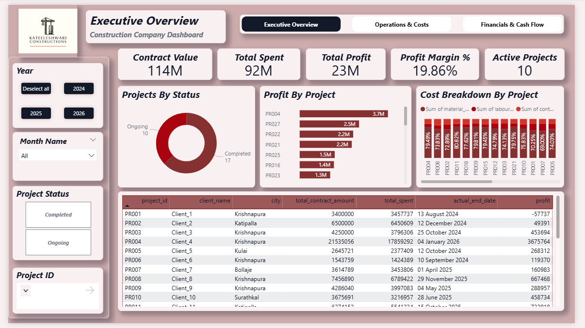
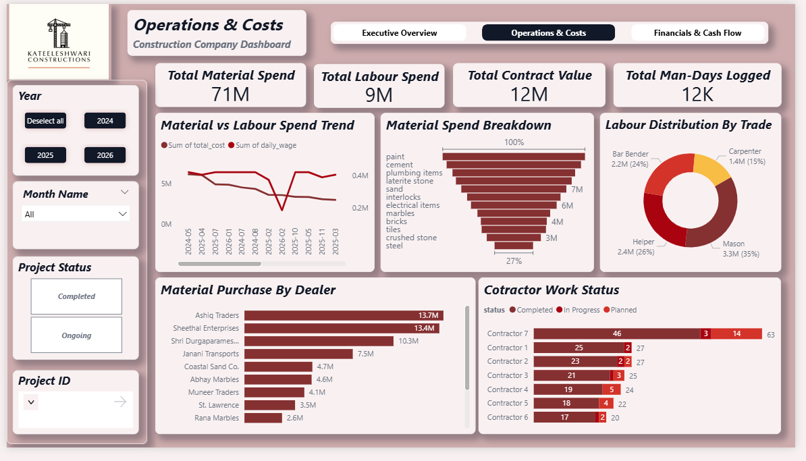
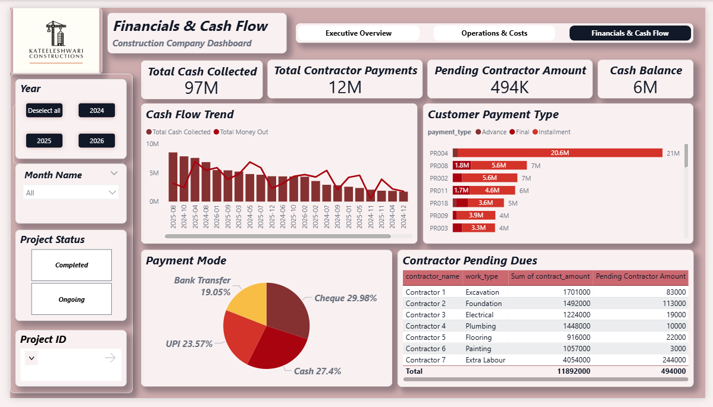

# 🏗️ Kateeleshwari Constructions - End-to-End Data Analytics Pipeline

## 🎯 Problem Statement
Construction firms frequently suffer from cash flow bottlenecks and budget overruns due to decentralized tracking of material costs, daily labour wages, and contractor payouts. The objective of this project is to centralize these disparate data sources and provide executives with real-time visibility into project profitability, pending dues, and overall liquidity.

## 📈 Executive Summary
This project processes thousands of daily operational records to manage a **$114M** total contract portfolio. By building an automated ETL pipeline, a relational database schema, and an interactive Power BI dashboard, this solution successfully:
* Tracks **$92M** in operational expenditures across 27 active and completed projects.
* Monitors an overall portfolio profit margin of **19.86%** ($23M Net Profit).
* Actively flags **$494K** in pending contractor payments to prevent supply-chain delays.

## 🛠️ Tech Stack
* **Data Processing & ETL:** Python (Pandas)
* **Database Management & Querying:** SQL Server (T-SQL, SSMS)
* **Business Intelligence:** Power BI (DAX, Data Modeling, Power Query)

---

## 🗄️ Data Architecture & Pipeline

### 1. Python ETL Pipeline (`/python/analysis.py`)
The pipeline uses Python and the Pandas library to automate financial aggregations prior to dashboard ingestion:
* Extracts raw daily entries for materials, labour, and contractor payouts.
* Merges distributed costs on `project_id`.
* Calculates dynamic engineered features: `total_spent` and `profit` (`total_contract_amount` - `total_spent`).

### 2. Advanced SQL Analytics (`/sql/`)
The repository contains 14 specialized analytical queries utilized to validate BI logic, test data integrity, and extract direct business insights. Key highlights include:
* **Budget Variance Analysis (`project_over_budjet.sql`):** Utilizes sequential CTEs to aggregate material, labor, and contract expenses, comparing them against total contract values to identify projects exceeding budget.
* **Profitability Tracking (`profit_loss.sql`):** Employs complex joins and aggregations to calculate net profit margins per project.
* **Cash Flow Trending (`monthly_expense.sql`):** Uses `UNION ALL` to merge disparate daily operational expense tables into a clean, time-series monthly trend for liquidity analysis.
* **Procurement Insights (`Top5_dealers.sql`):** Identifies top supply chain vendors by total spend using `TOP` and `ORDER BY` clauses to inform future contract negotiations.
* **Cost Distribution (`labour_percentage.sql`, `contract_cost.sql`):** Tracks the percentage of total budget allocated to different operational wings.

### 3. Business Intelligence Dashboard (`/dashboard/`)
The interactive Power BI report (`Construction_Analytics.pbix`) is divided into three core analytical pages:
* **Executive Overview:** High-level KPIs tracking Total Revenue, Total Spend, and overall Profit Margins, alongside visual breakdowns of project profitability.
* **Operations & Costs:** Root-cause analysis breaking down the Total Contract Amount by `status` ➡️ `work_type` ➡️ `contractor_name`.
* **Financials & Cash Flow:** Tracks 'Money In' ($97M Customer Payments) vs. 'Money Out' ($12M Contractor Spend) over time, alongside a dynamic alert system identifying outstanding contractor balances.

---

## 📂 Repository Structure

├── data/                           # Synthetic operational CSV datasets (for pipeline reproduction)
│   ├── contract_work.csv
│   ├── contractor_payment.csv
│   └── ... 
├── python/
│   └── analysis.py                 # ETL script for data aggregation
├── sql/
│   ├── avg_labour.sql              # Labour cost aggregations
│   ├── contract_cost.sql           # Contractor budget tracking
│   ├── labour_cost.sql             # Total labour expenditure per project
│   ├── labour_percentage.sql       # Resource allocation analysis
│   ├── material_cost.sql           # Total material cost tracking
│   ├── monthly_expense.sql         # UNION ALL query for cash flow
│   ├── monthly_revenue.sql         # Customer payment time-series
│   ├── payment_status.sql          # Contractor payment status aggregation
│   ├── pending_customer_payment.sql# Revenue tracking & pending client dues
│   ├── profit_loss.sql             # Multi-CTE profit calculations
│   ├── project_count.sql           # Project status distribution
│   ├── project_over_budjet.sql     # Multi-CTE budget variance flagging
│   ├── Top5_dealers.sql            # Procurement vendor analysis
│   └── total_customer_payment.sql  # Aggregate customer revenue
├── dashboard/
│   ├── Construction_Analytics.pbix # Power BI interactive dashboard
│   └── construction2.pdf           # Static export of executive dashboard views
└── README.md

---

## 🚀 How to Run the Project
1. Clone the repository to your local machine.
2. Ensure you have your SQL Server environment set up. You can use the provided CSV files in the `/data` folder to populate your tables via the Import Flat File wizard or `BULK INSERT`.
3. Run the analytical queries found in the `/sql/` directory to explore the data.
4. Open `/dashboard/Construction_Analytics.pbix` in Power BI Desktop and refresh the data connections to view the interactive visualizations.

---

## 📸 Dashboard Previews

*(Replace the image paths below with the actual names of your screenshot files once uploaded to the repository, e.g., `page1.png`)*

### Page 1: Executive Overview

### Page 2: Operations and Project Tracking

### Page 3: Cash Flow and Liquidity

